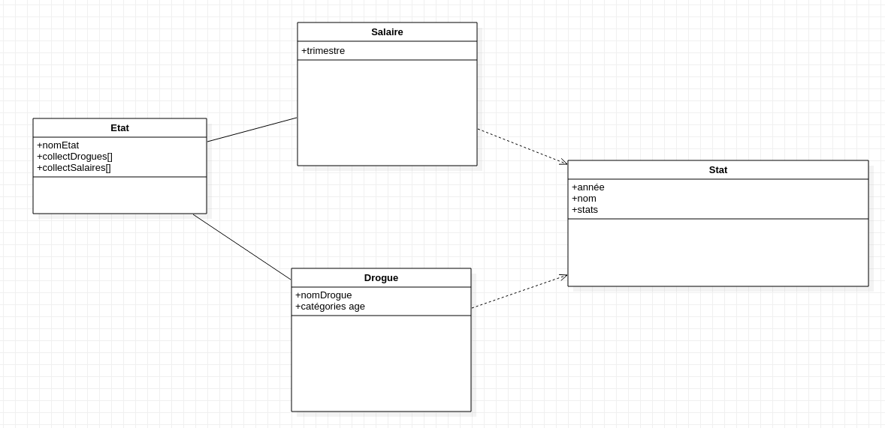

# <center> Bills and Pills </center>
*<center> Projet Open Data </center>*


L'objectif de notre projet est de créer une API (en Node.js) permettant de récolter des données sur la consommation de drogues et les salaires moyens aux États-unis, de l'année 2013 à l'année 2019. Les données ont été récoltées sur le site du [Bureau of Economic Analysis (BEA)](https://www.bea.gov/) ainsi que sur le site des [Substance Abuse and Mental Health Service Administration (SAMHSA)](https://www.samhsa.gov/), accessibles en dynamique via une requête HTTP.

# Organisation 

Le groupe s'est séparé en sous-groupes pour avancer en parallèle sur les sous-tâches majeures, à savoir:
- Formater les données (collecteurs de données)
- Application les filtres
- Gestion des différents formats de sorties (JSON, XML, RDF)
- Mise en relation des différentes entitées créées


# RDF

Le format RDF est un modèle de données standardisé developpé par le W3C, c'est le langage de base du Web Sémantique. Il permet la description de ressources Webs ainsi que de leurs métadonnées et possède plusieurs syntaxes. 
Pour la suite nous avons choisi de travailler avec RDF/XML.

Etant donné qu'aucun vocabulaire RDF existant ne correspond à nos données, nous avons dans un premier temps défini le vocabulaire RDF nécessaire. Nous avons défini des classes, des sous-classes, et des propriétés pour ces dernières.
Tout d'abord nous avons construit un diagrmame de classe basé sur la méthode UML. Nos différentes classes ainsi que leurs interactions sont réprésentées sur la figure ci dessous:




Notre vocabulaire est disponible dans le fichier */assets/vocabulary.rdf*.


# API
L'API peut récolter et croiser deux différents types de données, en passant par les chemins suivants :
- /wages : les salaires moyens
- /drugs : la consommation de drogues estimée
- /all : permet d'obtenir le croisement des deux types de données précédents

Nous verrons par la suite pour chaque chemin, comment manipuler plus en détail l'API et appliquer différents niveaux de filtres aux requêtes.

## Formats de Sortie
Pour tout type de requête il est possible de choisir le format des données renvoyées. Il suffit d'ajouter dans la requête un attribut **type** pour le type de format voulu, parmis XML, JSON et RDF. 

NB: Si aucun type n'est spécifié, les données seront envoyées dans le format JSON.

## Premier chemin : */Wages*
Par défaut, si aucun filtre n'est demandé, l'API renvoie les données de l'état d'Alabama, pour toutes les années entre 2013 et 2019, tous les trimestres, pour chacune des 3 statistiques suivantes: 

- *'Personal income'* : somme des revenus personnels dans l'état, en millions de dollars, corrigée des variations saisonnières
- *'Population'* : nombre d'habitants de l'état, en milieu de période
- *'Per capita personal income'* : Revenu moyen par individu de l'Etat, en dollars

Filtres applicables pour la sélection des données :
- **state** : applique un filtre sur les états voulus, pour obtenir plusieurs états il faut les séparer par une virgule
- **year** : applique un filtre sur les années spécifiées, entre 2013 et 2019:
  - "20XX" : pour obtenir sur une année
  - "20XX-20XX" : pour obtenir une plage d'années
  - "20XX,20XX" : pour obtenir des années spécifiques
- **quarter** : applique un filtre sur le(s) trimestre(s) spécifié(s), parmi [Q1, Q2, Q3, Q4]:
  - "QX" : pour obtenir un trimestre
  - "QX-QX" : pour obtenir une plage de trimestres
  - "QX,QX" : pour obtenir des trimestres spécifiques
- **metric** : pour obtenir une ou plusieurs métriques spécifiques, il faut les séparer par une virgule, parmi :
  - *personal_income* 
  - *population*
  - *per_capita_personal_income*

__Exemple :__

Je souhaite récolter les données de l'état de Washington et Californie, pour 2015 et 2017 au troisème trimestre:
```
/wages?state=Washington,California&year=2015,2017&quarter=Q3
```
Renvoie :
```json
{
    "Washington": {
        "2015": {
            "Q3": {
                "personal_income": "383645.8",
                "population": "7184839",
                "per_capita_personal_income": "53397"
            }
        },
        "2017": {
            "Q3": {
                "personal_income": "427814.4",
                "population": "7441358",
                "per_capita_personal_income": "57491"
            }
        }
    },
    "California": {
        "2015": {
            "Q3": {
                "personal_income": "2138781.8",
                "population": "38940551",
                "per_capita_personal_income": "54924"
            }
        },
        "2017": {
            "Q3": {
                "personal_income": "2325376.1",
                "population": "39356311",
                "per_capita_personal_income": "59085"
            }
        }
    }
}
```

## Second chemin : */Drugs* 

Ces données correspondent à des estimations de consommation de plusieurs types de drogues dans chaque état. On peut y retrouver des intervalles de confiance et/ou les valeurs estimées.
Par défaut, si aucun filtre n'est demandé, l'API renvoie les données de l'état d'Alabama, pour toutes les années entre 2013 et 2019, pour toute tranche d'âge, et toute catégorie de drogue.  


Filtres applicables pour la sélection des données :
- **state** : applique un filtre sur les états voulus, pour obtenir plusieurs états il faut les séparer par une virgule
- **year** : applique un filtre sur les années spécifiées, entre 2013 et 2019:
  - "20XX" : pour obtenir sur une année
  - "20XX-20XX" : pour obtenir une plage d'années
  - "20XX,20XX" : pour obtenir des années spécifiques
- **estimate** : false pour obtenir les intervalles de confiance, true pour obtenir une estimation, si rien n'est spécifié les deux sont retournés
- **age** : pour obtenir seulement certaines catégories d'âges parmi:
  - 12-17
  - 18-25
  - 12+
  - 18+
  - 26+
- **drug** : pour obtenir seulement les données sur une ou plusieurs catégories de drogue, pour plusieurs drogues, parmi [*alcohol*, *cigarette*, *cocaine*, *marijuana*, *heroin*, *illicit_drug*, *substance*, *pain_reliever*, *tobacco_product*, *depressive*, *methamphetamine*, *suicide*, *mental*] (à séparer par une virgule).


__Exemple :__

Je souhaite récolter les données estimées  du nombre de consommateurs liés à la Marijuana pour les états de Californie et Washington, en 2016, sur les tranches d'âge des 12-17 ans et plus de 26 ans.
```
/drugs?state=California,Washington&year=2016&drug=marijuana&age=12-17,26+&estimate=true
```
Renvoie :
```json
{
    "California": {
        "2016": {
            "12-17-Estimate": {
                "marijuana": {
                    "first_use_of_marijuana": "150",
                    "illicit_drug_use_other_than_marijuana_in_the_past_month": "81",
                    "marijuana_use_in_the_past_month": "223",
                    "marijuana_use_in_the_past_year": "402",
                    "perceptions_of_great_risk_from_smoking_marijuana_once_a_month": "723"
                }
            },
            "26+Estimate": {
                "marijuana": {
                    "first_use_of_marijuana": "66",
                    "illicit_drug_use_other_than_marijuana_in_the_past_month": "859",
                    "marijuana_use_in_the_past_month": "2,190",
                    "marijuana_use_in_the_past_year": "3,399",
                    "perceptions_of_great_risk_from_smoking_marijuana_once_a_month": "8,239"
                }
            }
        }
    },
    "Washington": {
        "2016": {
            "12-17-Estimate": {
                "marijuana": {
                    "first_use_of_marijuana": "26",
                    "illicit_drug_use_other_than_marijuana_in_the_past_month": "14",
                    "marijuana_use_in_the_past_month": "42",
                    "marijuana_use_in_the_past_year": "72",
                    "perceptions_of_great_risk_from_smoking_marijuana_once_a_month": "98"
                }
            },
            "26+Estimate": {
                "marijuana": {
                    "first_use_of_marijuana": "18",
                    "illicit_drug_use_other_than_marijuana_in_the_past_month": "148",
                    "marijuana_use_in_the_past_month": "508",
                    "marijuana_use_in_the_past_year": "784",
                    "perceptions_of_great_risk_from_smoking_marijuana_once_a_month": "963"
                }
            }
        }
    }
}
```
## Troisième chemin : */All*

Les données extraites de ce chemin sont le fruit du croisement des deux types de données évoquées précédemment. Pour le même état, la même année, il est possible d'obtenir à la fois les statistiques de revenus et de consommation de drogues. 


Filtres applicables pour la sélection des données :
- **state** : applique un filtre sur les états voulus, pour obtenir plusieurs états il faut les séparer par une virgule
- **year** : applique un filtre sur les années spécifiées, entre 2013 et 2019:
  - "20XX" : pour obtenir sur une année
  - "20XX-20XX" : pour obtenir une plage d'années
  - "20XX,20XX" : pour obtenir des années spécifiques
- **quarter** : applique un filtre sur le(s) trimestre(s) spécifié(s), parmi [Q1, Q2, Q3, Q4]:
  - "QX" : pour obtenir un trimestre
  - "QX-QX" : pour obtenir une plage de trimestres
  - "QX,QX" : pour obtenir des trimestres spécifiques
- **metric** : pour obtenir une ou plusieurs métriques spécifiques, il faut les séparer par une virgule, parmi :
  - *personal_income* 
  - *population*
  - *per_capita_personal_income*
- **estimate** : false pour obtenir les intervalles de confiance, true pour obtenir une estimation, si rien n'est spécifié les deux sont retournés
- **age** : pour obtenir seulement certaines catégories d'âges parmi:
  - 12-17
  - 18-25
  - 12+
  - 18+
  - 26+
- **drug** : pour obtenir seulement les données sur une ou plusieurs catégories de drogue, pour plusieurs drogues, parmi [*alcohol*, *cigarette*, *cocaine*, *marijuana*, *heroin*, *illicit_drug*, *substance*, *pain_reliever*, *tobacco_product*, *depressive*, *methamphetamine*, *suicide*, *mental*] (à séparer par une virgule).

__Exemple :__

Je souhaite récolter les données pour l'état de Californie en 2015 et en 2018, statistiques de revenus du deuxième au quatrième trimestre, et statistiques de consommations (estimées et intervalle de confiance) de cocaïne et héroïne pour les plus de 26 ans. 

La requête :
```
/all?state=California&year=2015,2018&quarter=Q2-Q4&age=26+&drug=heroin,cocaine
```
Renvoie :
```json
{
    "California": {
        "2015": {
            "wages": {
                "Q2": {
                    "personal_income": "2117632.1",
                    "population": "38865317",
                    "per_capita_personal_income": "54486"
                },
                "Q3": {
                    "personal_income": "2138781.8",
                    "population": "38940551",
                    "per_capita_personal_income": "54924"
                },
                "Q4": {
                    "personal_income": "2161117.7",
                    "population": "39008270",
                    "per_capita_personal_income": "55402"
                }
            },
            "drugs": {
                "26+Estimate": {
                    "heroin": {
                        "heroin_use_in_the_past_year": "37"
                    },
                    "cocaine": {
                        "cocaine_use_in_the_past_year": "407"
                    }
                },
                "26+95L": {
                    "heroin": {
                        "heroin_use_in_the_past_year": "19"
                    },
                    "cocaine": {
                        "cocaine_use_in_the_past_year": "328"
                    }
                },
                "26+95U": {
                    "heroin": {
                        "heroin_use_in_the_past_year": "73"
                    },
                    "cocaine": {
                        "cocaine_use_in_the_past_year": "504"
                    }
                }
            }
        },
        "2018": {
            "wages": {
                "Q2": {
                    "personal_income": "2419125.1",
                    "population": "39424643",
                    "per_capita_personal_income": "61361"
                },
                "Q3": {
                    "personal_income": "2449911.3",
                    "population": "39443390",
                    "per_capita_personal_income": "62112"
                },
                "Q4": {
                    "personal_income": "2470501.2",
                    "population": "39450951",
                    "per_capita_personal_income": "62622"
                }
            },
            "drugs": {
                "26+Estimate": {
                    "heroin": {
                        "heroin_use_in_the_past_year": "47",
                        "perceptions_of_great_risk_from_trying_heroin_once_or_twice": "22,222"
                    },
                    "cocaine": {
                        "cocaine_use_in_the_past_year": "585",
                        "perceptions_of_great_risk_from_using_cocaine_once_a_month": "17,861"
                    }
                },
                "26+95L": {
                    "heroin": {
                        "heroin_use_in_the_past_year": "25",
                        "perceptions_of_great_risk_from_trying_heroin_once_or_twice": "21,922"
                    },
                    "cocaine": {
                        "cocaine_use_in_the_past_year": "491",
                        "perceptions_of_great_risk_from_using_cocaine_once_a_month": "17,471"
                    }
                },
                "26+95U": {
                    "heroin": {
                        "heroin_use_in_the_past_year": "89",
                        "perceptions_of_great_risk_from_trying_heroin_once_or_twice": "22,502"
                    },
                    "cocaine": {
                        "cocaine_use_in_the_past_year": "697",
                        "perceptions_of_great_risk_from_using_cocaine_once_a_month": "18,241"
                    }
                }
            }
        }
    }
}
```


## Pour aller plus loin ...

Concernant l'API, nous souhaitions également ajouter des filtres sur les types de statistiques pour chaque catégorie de drogues, à savoir: premier usage, risques de consommation, consommation mois ou année passée, etc... 

Avec plus de temps devant nous, nous aurions pris le temps de faire une interface client générant automatiquement l'URL de requête, après sélection des filtres sur menus déroulants et boutons à cocher.

Nous aurions pu utiliser les fichiers de données générés pour construire des visualisations, améliorant l'aspect de croisement d'informations. 
